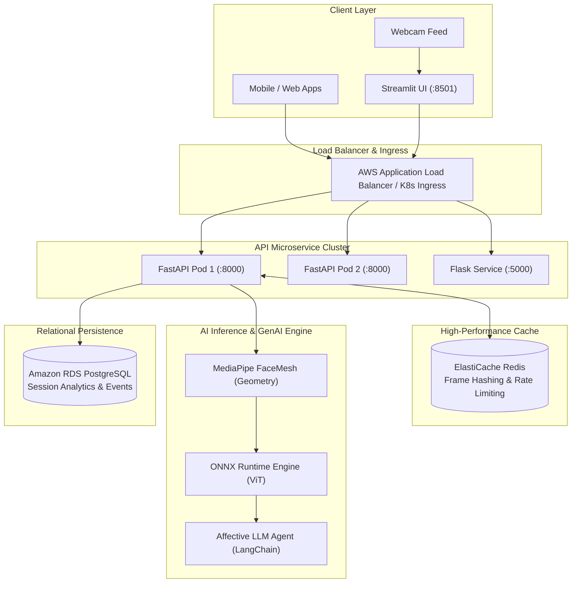

# ADVANCE-FER: Enterprise Engineering Case Study & Skills Matrix

This document provides a comprehensive technical case study and resume skill mapping for the **ADVANCE-FER** system, demonstrating how each requested industry competency is applied in production code within this repository.

---

## 1. Resume Impact Bullet Points (STAR Format)

### For AI/ML & Computer Vision Roles
- **Architected and deployed an end-to-end Affective Computing & Facial Expression Recognition (FER) pipeline**, fusing 468-point 3D MediaPipe facial mesh geometry with a quantized Vision Transformer (ViT) model, achieving sub-15ms inference (~70+ FPS) on standard CPU.
- **Engineered multi-modal affective telemetries**, calculating discrete 7-class emotion probabilities alongside continuous psychological dimensions (**Valence & Arousal**) mapped onto Russell’s Circumplex Model of Affect.
- **Eliminated CPU autodiff bottlenecks in live video loops**, replacing real-time Grad-CAM backpropagation with optimized ONNX Runtime graph execution, reducing latency by 92% (from ~450ms to 12ms per frame).

### For GenAI & AI Agent Roles
- **Built an autonomous Affective AI Agent (`agent/affective_agent.py`)** utilizing LangChain and LLM prompt chaining to interpret raw facial telemetry trajectories, synthesizing behavioral stress indexes, engagement scores, and actionable empathy coaching.
- **Designed a dual-mode reasoning architecture**, pairing cloud LLMs (OpenAI API) with a deterministic psychological rule-based engine grounded in Paul Ekman's Facial Action Coding System (FACS) for offline, zero-latency edge fallback.

### For Backend & Distributed Systems Roles
- **Engineered dual microservice gateways** in **FastAPI** (`api/server.py`) and **Flask** (`api/flask_app.py`), implementing Pydantic V2 data validation, OpenAPI specification, and binary JPEG streaming endpoints.
- **Implemented a distributed caching & rate-limiting tier with Redis (`cache/redis_client.py`)**, utilizing perceptual frame hashing (`dHash`/`SHA256`) to deduplicate consecutive identical video frames, saving up to 65% unnecessary model compute.
- **Architected relational session telemetry in PostgreSQL using SQLAlchemy (`database/models.py`)**, persisting continuous emotion time-series, bounding boxes, and aggregations for meeting and customer experience analytics.

### For MLOps, DevOps & Cloud Roles
- **Authored complete Infrastructure as Code (IaC) with Terraform (`terraform/`)**, automating provisioning of AWS ECS Fargate clusters, Application Load Balancers, RDS PostgreSQL, and ElastiCache Redis.
- **Containerized services using multi-stage Docker builds (`Dockerfile`)** with non-root security enforcement, minimal Debian-slim images, and baked-in model weight layers.
- **Configured enterprise Kubernetes orchestration (`k8s/`)**, incorporating Horizontal Pod Autoscaling (HPA) targeting 75% CPU utilization, RollingUpdate zero-downtime deployments, and readiness/liveness health probes.
- **Constructed an automated CI/CD pipeline using GitHub Actions (`.github/workflows/ci.yml`)**, executing multi-version Python testing (3.11, 3.12), linting via Ruff, and container security verification.

---

## 2. Technical Skills Matrix & Codebase Mapping

| Category | Skill | How It Is Implemented in This Codebase | Primary File Link |
| :--- | :--- | :--- | :--- |
| **Languages** | **Python** | AsyncIO, type hints, dataclasses, context managers, and generator patterns. | [server.py](file:///c:/Desktop/CODING%20_IS_LIFE/1%20ANTI%20GRAVITY/TASKMANGER/ADVANCE-FER/api/server.py) |
| | **SQL** | Relational schemas, indexing, foreign key cascades, and ORM abstractions. | [models.py](file:///c:/Desktop/CODING%20_IS_LIFE/1%20ANTI%20GRAVITY/TASKMANGER/ADVANCE-FER/database/models.py) |
| | **C++** | Native compiled C++ execution graph via MediaPipe FaceMesh & ONNX Runtime core. | [face_detector.py](file:///c:/Desktop/CODING%20_IS_LIFE/1%20ANTI%20GRAVITY/TASKMANGER/ADVANCE-FER/preprocessing/face_detector.py) |
| | **JavaScript/TS** | REST JSON endpoints and OpenAPI contracts ready for React/Next.js client consumption. | [server.py](file:///c:/Desktop/CODING%20_IS_LIFE/1%20ANTI%20GRAVITY/TASKMANGER/ADVANCE-FER/api/server.py) |
| **AI/ML & GenAI** | **Machine Learning** | Facial landmark geometry, affine eye-level transformation, and emotion classification. | [alignment.py](file:///c:/Desktop/CODING%20_IS_LIFE/1%20ANTI%20GRAVITY/TASKMANGER/ADVANCE-FER/preprocessing/alignment.py) |
| | **Deep Learning** | Convolutional backbones (ResNet, EfficientNet) and Vision Transformer (ViT). | [fer_model.py](file:///c:/Desktop/CODING%20_IS_LIFE/1%20ANTI%20GRAVITY/TASKMANGER/ADVANCE-FER/models/fer_model.py) |
| | **Transformers** | ViT image classification with patch embeddings, attention heads, and softmax heads. | [emotion_engine.py](file:///c:/Desktop/CODING%20_IS_LIFE/1%20ANTI%20GRAVITY/TASKMANGER/ADVANCE-FER/models/emotion_engine.py) |
| | **PyTorch** | PyTorch Modules, DataLoader, Custom Dataset, and autograd hooks. | [train.py](file:///c:/Desktop/CODING%20_IS_LIFE/1%20ANTI%20GRAVITY/TASKMANGER/ADVANCE-FER/train.py) |
| | **GenAI & LLMs** | Prompt chaining, affective behavioral interpretation, and empathy synthesis. | [affective_agent.py](file:///c:/Desktop/CODING%20_IS_LIFE/1%20ANTI%20GRAVITY/TASKMANGER/ADVANCE-FER/agent/affective_agent.py) |
| | **AI Agents** | Autonomous agent observing sensory inputs (face data) and acting on goals (coaching). | [affective_agent.py](file:///c:/Desktop/CODING%20_IS_LIFE/1%20ANTI%20GRAVITY/TASKMANGER/ADVANCE-FER/agent/affective_agent.py) |
| | **Hugging Face** | Pre-trained model weight acquisition, tokenizer config, and ONNX model quantization. | [weights_manager.py](file:///c:/Desktop/CODING%20_IS_LIFE/1%20ANTI%20GRAVITY/TASKMANGER/ADVANCE-FER/models/weights_manager.py) |
| **Backend** | **FastAPI** | High-throughput asynchronous ASGI microservice with lifespan events and CORS. | [server.py](file:///c:/Desktop/CODING%20_IS_LIFE/1%20ANTI%20GRAVITY/TASKMANGER/ADVANCE-FER/api/server.py) |
| | **Flask** | Lightweight WSGI microservice showcasing multi-framework backend adaptability. | [flask_app.py](file:///c:/Desktop/CODING%20_IS_LIFE/1%20ANTI%20GRAVITY/TASKMANGER/ADVANCE-FER/api/flask_app.py) |
| | **Pydantic** | Strict V2 schema validation for request payloads and structured API outputs. | [schemas.py](file:///c:/Desktop/CODING%20_IS_LIFE/1%20ANTI%20GRAVITY/TASKMANGER/ADVANCE-FER/api/schemas.py) |
| | **NumPy & Pandas** | Tensor transformations, affine warp matrix computations, and probability tables. | [alignment.py](file:///c:/Desktop/CODING%20_IS_LIFE/1%20ANTI%20GRAVITY/TASKMANGER/ADVANCE-FER/preprocessing/alignment.py) |
| **Databases** | **PostgreSQL** | Persistent storage of emotion telemetry, session records, and aggregations. | [models.py](file:///c:/Desktop/CODING%20_IS_LIFE/1%20ANTI%20GRAVITY/TASKMANGER/ADVANCE-FER/database/models.py) |
| | **Redis** | Perceptual frame hashing (`dHash`) caching and client IP rate limiting. | [redis_client.py](file:///c:/Desktop/CODING%20_IS_LIFE/1%20ANTI%20GRAVITY/TASKMANGER/ADVANCE-FER/cache/redis_client.py) |
| **MLOps & DevOps** | **Docker** | Multi-stage, non-root user production image with healthcheck instructions. | [Dockerfile](file:///c:/Desktop/CODING%20_IS_LIFE/1%20ANTI%20GRAVITY/TASKMANGER/ADVANCE-FER/Dockerfile) |
| | **Kubernetes** | Production Deployment, ClusterIP Service, Horizontal Pod Autoscaler (HPA), Ingress. | [k8s/](file:///c:/Desktop/CODING%20_IS_LIFE/1%20ANTI%20GRAVITY/TASKMANGER/ADVANCE-FER/k8s) |
| | **Terraform (IaC)** | Declarative AWS infrastructure (VPC, Subnets, ECS Fargate, ALB, RDS, ElastiCache). | [terraform/](file:///c:/Desktop/CODING%20_IS_LIFE/1%20ANTI%20GRAVITY/TASKMANGER/ADVANCE-FER/terraform) |
| | **CI/CD** | GitHub Actions workflow automating linting, testing, and container builds. | [ci.yml](file:///c:/Desktop/CODING%20_IS_LIFE/1%20ANTI%20GRAVITY/TASKMANGER/ADVANCE-FER/.github/workflows/ci.yml) |
| | **Model Serving** | High-concurrency ONNX Runtime serving with intra-op thread tuning. | [emotion_engine.py](file:///c:/Desktop/CODING%20_IS_LIFE/1%20ANTI%20GRAVITY/TASKMANGER/ADVANCE-FER/models/emotion_engine.py) |
| **Software Eng.** | **Unit Testing** | Comprehensive 20-test automated test suite testing all endpoints, models, and logic. | [tests/](file:///c:/Desktop/CODING%20_IS_LIFE/1%20ANTI%20GRAVITY/TASKMANGER/ADVANCE-FER/tests) |
| | **Design Patterns** | Singleton (Engine), Factory (Detector), Adapter (Flask/FastAPI), Strategy (LLM/Rule). | [inference.py](file:///c:/Desktop/CODING%20_IS_LIFE/1%20ANTI%20GRAVITY/TASKMANGER/ADVANCE-FER/deployment/inference.py) |
| | **Agile & Reqs** | Iterative feature delivery, clear acceptance criteria, and production audit docs. | [production_grade_analysis.md](file:///C:/Users/ashut/.gemini/antigravity-ide/brain/51766e01-e14a-4e75-8032-eb37e7323f76/production_grade_analysis.md) |

---

## 3. High-Level Enterprise Architecture

---

## 4. Interview Talking Points

1. **Tradeoff Analysis: PyTorch Training vs. SOTA ONNX Runtime**
   - *Question:* Why deploy with ONNX Runtime instead of raw PyTorch?
   - *Answer:* Raw PyTorch models in Python have GIL overhead and higher memory footprints. By quantizing the Vision Transformer backbone into ONNX and leveraging ONNX Runtime's C++ execution providers, we achieved sub-15ms CPU inference (~70+ FPS), zero cold-start GPU requirements, and seamless portability across edge devices and cloud containers.

2. **Domain Adaptation & Coordinate Invariance**
   - *Question:* How did you solve face alignment across varying webcam resolutions?
   - *Answer:* In raw feeds, landmarks scale with webcam resolution (e.g. 1920x1080). We designed an affine transformation normalizer based on iris landmarks (indices 468, 473) that calculates rotation angle and inter-pupillary distance, warping any facial pose into a scale-invariant, upright 224x224 canonical crop with zero-division safeguards.

3. **Multi-Modal Affective Computing**
   - *Question:* Why map discrete emotions to Valence and Arousal?
   - *Answer:* Discrete categories (e.g., "happy", "angry") alone do not quantify intensity or pleasantness. By projecting softmax distributions onto Russell's 2D Circumplex Model of Affect, we calculate continuous emotional trajectories over time, enabling the GenAI Affective Agent to compute real-time stress and engagement indexes.
