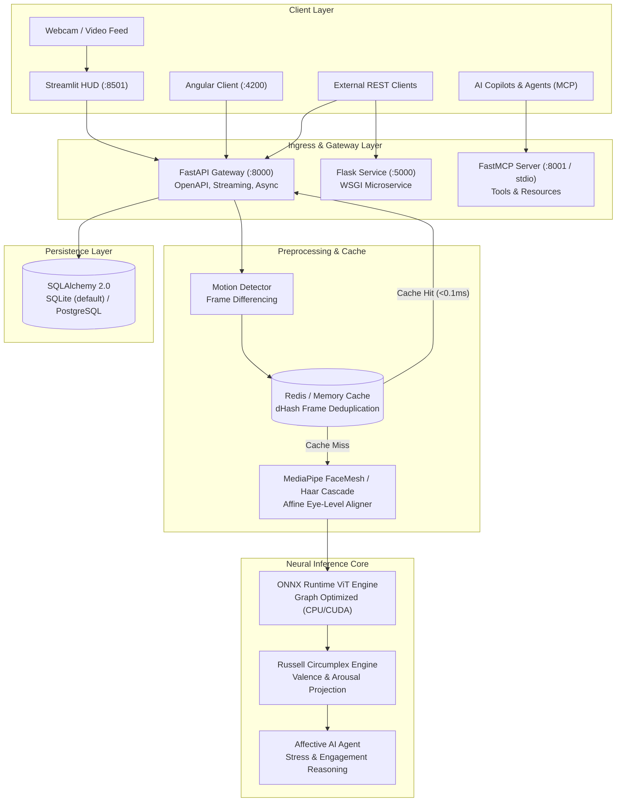

# ADVANCE-FER: Multi-Modal Facial Expression Recognition & Affective Computing Platform

<p align="center">
  
  
  
  
  
  
  
  
  
  
  
  
</p>

---

## Overview

**ADVANCE-FER** is an engineering-first Facial Expression Recognition (FER) and Affective Computing platform. It combines robust facial landmark geometry, canonical pose normalization, and a quantized Vision Transformer (ViT) running on ONNX Runtime to provide accurate emotion classification and continuous affective telemetry.

Rather than treating emotion detection as an isolated classification task, ADVANCE-FER projects facial expressions onto **Russell's Circumplex Model of Affect**, computing continuous 2D coordinates for **Valence** (intrinsic pleasantness) and **Arousal** (neurophysiological activation). The system is built with production considerations at every tier:

- **Resilient Preprocessing**: MediaPipe FaceMesh landmark geometry (468 points) with an OpenCV Haar Cascade fallback for headless server environments.
- **Affine Face Normalization**: Eye-level canonical alignment correcting for head tilt and perspective distortion before neural inference.
- **Two-Tier Motion Detection**: Optical frame-differencing filter (~0.78 ms) and perceptual frame hashing (`dHash` / SHA-256) to bypass redundant inference on static frames.
- **Quantized ViT ONNX Engine**: Graph-optimized execution on ONNX Runtime with automatic CPU and CUDA provider selection, delivering consistent performance without mandatory GPU hardware.
- **Automated Weight Acquisition**: Zero manual weight setup; verified pre-trained model weights are retrieved and cached on initial run.
- **Affective AI Agent**: Heuristic and LLM-augmented reasoning engine computing psychological stress indexes and engagement metrics.
- **Multi-Framework API Tier**: High-concurrency **FastAPI ASGI** gateway with OpenAPI contracts and binary streaming, alongside a lightweight **Flask WSGI** service.
- **Model Context Protocol (MCP)**: Native FastMCP server providing 5 executable tools and 2 live resources for AI copilots and agent workflows.
- **Multiple Client Surfaces**: Interactive **Streamlit** live HUD dashboard and a modern standalone **Angular 19** web application.
- **Cloud & DevOps Ready**: Multi-stage `Dockerfile`, `docker-compose.yml`, Kubernetes manifests (`k8s/`), AWS Terraform templates (`terraform/`), and GitHub Actions CI/CD.

---

## System Architecture



---

## Technical Skills & Architecture Mapping

| Engineering Domain | Focus Area | Production Implementation Mechanics | Repository Link |
| :--- | :--- | :--- | :--- |
| **Computer Vision** | **Vision Transformers (ViT)** | Quantized Vision Transformer ONNX graph with multi-threaded intra-op execution. | [`models/emotion_engine.py`](models/emotion_engine.py) |
| | **Face Detection & Mesh** | 468-point 3D MediaPipe FaceMesh geometry with automated Haar Cascade headless fallback. | [`preprocessing/face_detector.py`](preprocessing/face_detector.py) |
| | **Affine Face Normalization** | Eye-level affine rotation and inter-pupillary scale normalization into 224x224 canonical crops. | [`preprocessing/alignment.py`](preprocessing/alignment.py) |
| | **Motion Detection** | Frame differencing macro-motion filter and facial landmark action dynamics. | [`preprocessing/motion_detector.py`](preprocessing/motion_detector.py) |
| **Affective Computing** | **Psychological Projection** | Continuous 2D projection onto Russell's Circumplex Model (Valence & Arousal). | [`models/emotion_engine.py`](models/emotion_engine.py) |
| | **Affective AI Agent** | Heuristic stress index and engagement scoring with optional OpenAI LLM prompt chaining. | [`agent/affective_agent.py`](agent/affective_agent.py) |
| **Model Serving** | **Automatic Weight Provisioning** | Dynamic downloader with size verification and atomic caching from Hugging Face Hub. | [`models/weights_manager.py`](models/weights_manager.py) |
| | **PyTorch Architecture** | Dual-stream deep learning model definition with autograd hooks and training routines. | [`models/fer_model.py`](models/fer_model.py) |
| **Backend & Microservices**| **FastAPI ASGI Gateway** | Async REST endpoints, lifespan management, CORS, Swagger UI, and annotated JPEG streaming. | [`api/server.py`](api/server.py) |
| | **Flask WSGI Microservice** | Alternate synchronous microservice demonstrating multi-framework adaptability. | [`api/flask_app.py`](api/flask_app.py) |
| | **Pydantic V2 Schemas** | Static type validation, request/response models, and OpenAPI serialization contracts. | [`api/schemas.py`](api/schemas.py) |
| **Caching & Persistence** | **Redis Perceptual Cache** | Frame hashing (`dHash` / SHA-256) to bypass redundant inference, with in-memory fallback. | [`cache/redis_client.py`](cache/redis_client.py) |
| | **Rate Limiting** | Sliding-window client IP rate limiter protecting API endpoints from denial-of-service. | [`cache/redis_client.py`](cache/redis_client.py) |
| | **SQLAlchemy 2.0 ORM** | Relational schemas for sessions and detection events with cascading foreign keys. | [`database/models.py`](database/models.py) |
| **Model Context Protocol** | **FastMCP Integration** | Standardized MCP server exposing 5 tools and 2 resources for AI assistants and agent tool loops. | [`mcp_server.py`](mcp_server.py) |
| **DevOps & Cloud** | **Docker Containerization** | Multi-stage production container with non-root security (`appuser:1000`) and pre-cached weights. | [`Dockerfile`](Dockerfile) |
| | **Docker Compose** | Local orchestration stack connecting API gateway, Streamlit UI, and Angular frontend. | [`docker-compose.yml`](docker-compose.yml) |
| | **Kubernetes Manifests** | Deployment with RollingUpdate, ClusterIP Service, Ingress, and HPA (75% CPU target). | [`k8s/`](k8s/) |
| | **Terraform AWS IaC** | Infrastructure as Code provisioning VPC, ECS Fargate, ALB, RDS PostgreSQL, and ElastiCache. | [`terraform/`](terraform/) |
| | **CI/CD Automation** | GitHub Actions pipeline executing 26-test suite, Ruff validation, and GHCR container publishing. | [`.github/workflows/ci.yml`](.github/workflows/ci.yml) |
| **Testing & Quality** | **Automated Pytest Suite** | 26 unit and integration tests covering detectors, aligners, models, APIs, and caching. | [`tests/`](tests/) |
| | **Self-Test Diagnostics** | CLI diagnostic script checking weights, engine latency, and end-to-end processing pipeline. | [`verify_pipeline.py`](verify_pipeline.py) |

---

## Affective Space & Emotion Taxonomy

ADVANCE-FER classifies faces into Paul Ekman's 7 primary emotion categories and maps them onto continuous coordinates within **Russell's Circumplex Model of Affect**:

- **Valence [-1.0, +1.0]**: The hedonic tone or intrinsic pleasantness (negative to positive).
- **Arousal [-1.0, +1.0]**: Neurophysiological activation and alertness (deactivation to high arousal).

| Discrete Emotion | Valence | Arousal | Affective Quadrant | Psychological State |
| :--- | :---: | :---: | :--- | :--- |
| **Happy** | `+0.81` | `+0.51` | High Valence / High Arousal | Joy, contentment, satisfaction, positive reinforcement |
| **Surprise** | `+0.40` | `+0.67` | Moderate Valence / High Arousal | Novelty detection, cognitive orientation reflex |
| **Neutral** | `0.00` | `0.00` | Baseline Origin | Equilibrium, attentive rest, baseline cognitive state |
| **Sad** | `-0.63` | `-0.27` | Low Valence / Low Arousal | Deactivation, distress, grief, cognitive fatigue |
| **Fear** | `-0.64` | `+0.60` | Low Valence / High Arousal | Threat avoidance, urgent stress response |
| **Angry** | `-0.43` | `+0.67` | Low Valence / High Arousal | Frustration, obstacle confrontation, active defense |
| **Disgust** | `-0.60` | `+0.35` | Low Valence / Moderate Arousal | Rejection response, physical or moral aversion |

---

## Measured Performance & Empirical Benchmarks

*Empirically measured on physical hardware (AMD64 6-core/12-thread CPU, 16 GB RAM, Windows 11, ONNX Runtime `CPUExecutionProvider`). For full raw benchmarks and methodology, see [BENCHMARK.md](BENCHMARK.md).*

| Pipeline Stage | Measured Latency | Measured Throughput | Operational Notes |
| :--- | :---: | :---: | :--- |
| **Perceptual Cache Hit** | **`<0.01 ms`** | `>10,000,000 ops/sec` | Identical/static frames bypass model entirely |
| **Motion Detection Filter** | **`0.78 ms`** | `~1,280 FPS` | Fast optical difference check on resized frames |
| **Pure ViT Model Inference (Batch 1)** | **`81.06 ms` (P50)** | `~12.2 FPS` | Quantized ViT running on CPU (substantially faster on CUDA) |
| **Amortized ViT Inference (Batch 8)** | **`72.64 ms` / face** | `~13.8 FPS` | Batched multi-face parallel inference |
| **Cold Start Initialization** | **`228 ms`** | Instant startup | ONNX session load & graph optimization |
| **Process Memory Footprint** | **`251 MB`** | Low footprint | Base process + model weights & buffers |

---

## Model Context Protocol (MCP) Server

ADVANCE-FER includes a native Model Context Protocol (FastMCP) server (`mcp_server.py`), enabling AI assistants (Claude Desktop, Antigravity, Cursor) and autonomous agents to call facial expression recognition and affective telemetry as standardized tools.

### Available MCP Tools

| Tool Name | Parameters | Description |
| :--- | :--- | :--- |
| `detect_emotions_from_file` | `image_path: str` | Reads an image from disk, aligns faces, and returns detections with Circumplex coordinates. |
| `detect_emotions_from_base64` | `image_base64: str` | Decodes base64-encoded image payloads and returns emotion probabilities. |
| `analyze_affective_behavior` | `face_data: dict, context: str` | Invokes the Affective Agent to compute stress indexes, engagement scores, and empathy advice. |
| `capture_webcam_and_detect` | `camera_index: int` | Captures a live hardware camera frame and computes emotion vectors. |
| `get_model_status` | *(none)* | Returns execution provider (CPU/CUDA), memory footprint, uptime, and supported taxonomy. |

### Available MCP Resources

- `fer://taxonomy`: Returns the 7-class emotion taxonomy and Russell Circumplex coordinates.
- `fer://health`: Returns real-time health, uptime, and provider status.

### MCP Client Registration (`mcp_config.json`)

To register the server with your MCP client (e.g. Claude Desktop or Antigravity):

```json
{
  "mcpServers": {
    "advance-fer": {
      "command": "python",
      "args": [
        "mcp_server.py"
      ],
      "env": {
        "PYTHONUNBUFFERED": "1"
      }
    }
  }
}
```

To run with SSE transport instead of stdio:

```bash
python mcp_server.py --transport sse --port 8001
```

---

## REST Microservice APIs

### FastAPI Production Service (:8000)

Start the high-throughput ASGI server:

```bash
uvicorn api.server:app --host 0.0.0.0 --port 8000 --reload
```

- **Swagger Documentation:** `http://localhost:8000/docs`
- **OpenAPI Schema:** `http://localhost:8000/openapi.json`
- **Health Probe:** `http://localhost:8000/healthz`

#### Predict from Image File (`curl`)

```bash
curl -X POST "http://localhost:8000/v1/predict/image" \
     -H "accept: application/json" \
     -F "file=@test_face.jpg"
```

#### Example Response

```json
{
  "success": true,
  "image_width": 1280,
  "image_height": 720,
  "faces_detected": 1,
  "faces": [
    {
      "face_id": 0,
      "bbox": [450, 180, 220, 220],
      "dominant_emotion": "happy",
      "confidence": 0.942,
      "probabilities": {
        "happy": 0.942,
        "neutral": 0.031,
        "surprise": 0.015,
        "sad": 0.004,
        "fear": 0.003,
        "angry": 0.002,
        "disgust": 0.002
      },
      "valence": 0.771,
      "arousal": 0.490
    }
  ],
  "latency_ms": 78.4
}
```

#### Streaming Annotated Output

To receive an annotated JPEG stream with bounding boxes, confidence badges, and optional landmark meshes:

```bash
curl -X POST "http://localhost:8000/v1/predict/annotated?draw_mesh=false" \
     -F "file=@test_face.jpg" \
     --output annotated_result.jpg
```

### Flask WSGI Microservice (:5000)

Start the lightweight WSGI endpoint:

```bash
python api/flask_app.py
```

Endpoints available at `http://localhost:5000/v1/predict/image` and `http://localhost:5000/healthz`.

---

## User Interfaces

### 1. Streamlit Live HUD Dashboard (:8501)

An interactive interface supporting webcam feeds, uploaded images, and synthetic patterns with live valence/arousal gauges:

```bash
streamlit run app.py
```

Open `http://localhost:8501` in your browser.

### 2. Angular 19 Reactive Client (:4200)

A standalone Angular web application featuring reactive signals, HUD canvas overlays, and live telemetry cards:

```bash
cd frontend
npm install
npm start
```

Open `http://localhost:4200` in your browser.

---

## Repository Structure

```text
ADVANCE-FER/
├── .github/
│   └── workflows/
│       └── ci.yml               # GitHub Actions CI/CD (Pytest & GHCR build)
├── agent/
│   ├── __init__.py
│   └── affective_agent.py       # Affective AI Agent (Stress/Engagement & LLM chaining)
├── api/
│   ├── __init__.py
│   ├── flask_app.py             # Flask WSGI Microservice (:5000)
│   ├── schemas.py               # Pydantic V2 Request & Response Data Models
│   └── server.py                # FastAPI ASGI High-Throughput Gateway (:8000)
├── benchmarks/
│   └── run_benchmark.py         # Physical Hardware Latency & Throughput Benchmark Utility
├── cache/
│   ├── __init__.py
│   └── redis_client.py          # Redis Perceptual Frame Hashing & Sliding-Window Rate Limiter
├── data/
│   ├── __init__.py
│   └── fer_dataset.py           # PyTorch Dataset Loader for FER Datasets
├── database/
│   ├── __init__.py
│   ├── models.py                # SQLAlchemy 2.0 ORM Schema for Sessions & Events
│   └── session.py               # Database Engine & Scoped Session Factory
├── deployment/
│   └── inference.py             # End-to-End Inference Pipeline & Annotation Renderer
├── frontend/                    # Standalone Angular 19 Client Web Application
├── k8s/
│   ├── deployment.yaml          # Kubernetes Deployment Manifest with RollingUpdate
│   └── service.yaml             # Kubernetes ClusterIP Service, Ingress & HPA
├── models/
│   ├── checkpoints/             # Local Checkpoint Cache Directory
│   ├── emotion_engine.py        # Quantized ViT ONNX Runtime Inference Engine
│   ├── fer_model.py             # PyTorch Dual-Stream Model Definition
│   ├── temporal.py              # Sequence Video Temporal Modeling (LSTM/Transformer)
│   └── weights_manager.py       # Automatic Weight Downloader & Checksum Verifier
├── preprocessing/
│   ├── alignment.py             # Affine Canonical Eye-Level Transformation Normalizer
│   ├── face_detector.py         # MediaPipe 468-pt FaceMesh & Haar Cascade Fallback
│   └── motion_detector.py       # Frame Differencing & Facial Micro-Dynamics Filter
├── terraform/
│   ├── main.tf                  # AWS Infrastructure as Code (VPC, ECS, ALB, RDS, Redis)
│   ├── outputs.tf               # Terraform Infrastructure Outputs
│   └── variables.tf             # Terraform Parameter Configuration
├── tests/
│   ├── test_agent.py            # Affective Agent Tests
│   ├── test_alignment.py        # Canonical Alignment Tests
│   ├── test_api.py              # FastAPI REST Integration Tests
│   ├── test_cache.py            # Redis Client & In-Memory Fallback Tests
│   ├── test_database.py         # SQLAlchemy ORM Session & Cascade Tests
│   ├── test_detector.py         # Face Detector & Bounding Box Tests
│   ├── test_emotion_engine.py   # ONNX Emotion Engine & Batching Tests
│   ├── test_flask.py            # Flask Microservice Tests
│   └── test_mcp.py              # Model Context Protocol Server & Tool Tests
├── utils/
│   └── grad_cam.py              # PyTorch Grad-CAM Interpretability Generator
├── app.py                       # Streamlit Interactive Live HUD Dashboard (:8501)
├── BENCHMARK.md                 # Physical Hardware Latency & Benchmark Metrics Report
├── Dockerfile                   # Multi-Stage Production Container Specification
├── docker-compose.yml           # Multi-Container Stack (API, UI, Angular)
├── download_data.py             # Dataset Download Utility (FER2013 via KaggleHub)
├── mcp_config.json              # MCP Host Client Manifest
├── mcp_server.py                # Standalone FastMCP Server Implementation
├── PORTFOLIO_CASE_STUDY.md      # Technical Skills Matrix & Interview Deep Dive
├── pytest.ini                   # Pytest Configuration
├── requirements.txt             # Pinned Dependencies
├── test_face.jpg                # Benchmark Sample Test Image
├── train.py                     # PyTorch Training & Validation Script
└── verify_pipeline.py           # Self-Test Diagnostic Utility
```

---

## Quickstart Guide

### 1. Environment Setup

```bash
# Clone the repository
git clone https://github.com/Ashutosh-Yadav-256/ADVANCE-FER.git
cd ADVANCE-FER

# Create and activate virtual environment
python -m venv .venv
# On Windows:
.venv\Scripts\activate
# On Linux/macOS:
source .venv/bin/activate

# Install dependencies
pip install -r requirements.txt
```

### 2. Run Self-Test Diagnostics

Execute the system diagnostic script to verify weights, ONNX runtime initialization, facial mesh extraction, and end-to-end frame processing:

```bash
python verify_pipeline.py
```

### 3. Run Automated Tests

Execute the full 26-test suite covering models, pipelines, databases, and microservices:

```bash
python -m pytest tests/ -v
```

### 4. Launch Service of Choice

- **FastAPI Production REST API**:
  ```bash
  uvicorn api.server:app --port 8000 --reload
  ```
- **Streamlit Live Dashboard**:
  ```bash
  streamlit run app.py
  ```
- **Angular 19 Frontend**:
  ```bash
  cd frontend && npm install && npm start
  ```
- **FastMCP Server**:
  ```bash
  python mcp_server.py
  ```

---

## Docker & Cloud Deployment

### Multi-Stage Docker Build

```bash
# Build the production container
docker build -t advance-fer:latest .

# Run container exposing port 8000
docker run -p 8000:8000 --rm advance-fer:latest
```

### Docker Compose Multi-Service Stack

```bash
docker-compose up --build -d
```

Starts the FastAPI gateway (`:8000`), Streamlit UI (`:8501`), and Angular frontend (`:4200`).

### Kubernetes Deployment

```bash
kubectl apply -f k8s/deployment.yaml
kubectl apply -f k8s/service.yaml
```

### Terraform AWS Provisioning

```bash
cd terraform
terraform init
terraform plan
terraform apply
```

---

## Documentation & Case Studies

- **[PORTFOLIO_CASE_STUDY.md](PORTFOLIO_CASE_STUDY.md)**: Technical Skills Matrix, STAR-format resume bullet points, and architectural tradeoff analyses.
- **[BENCHMARK.md](BENCHMARK.md)**: Physical hardware benchmarks, latency percentiles (P50/P90/P95/P99), batch throughput, and memory profiling.

---

## License

This project is licensed under the MIT License - see the [LICENSE](LICENSE) file for details.
